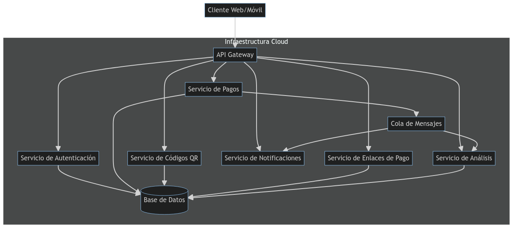
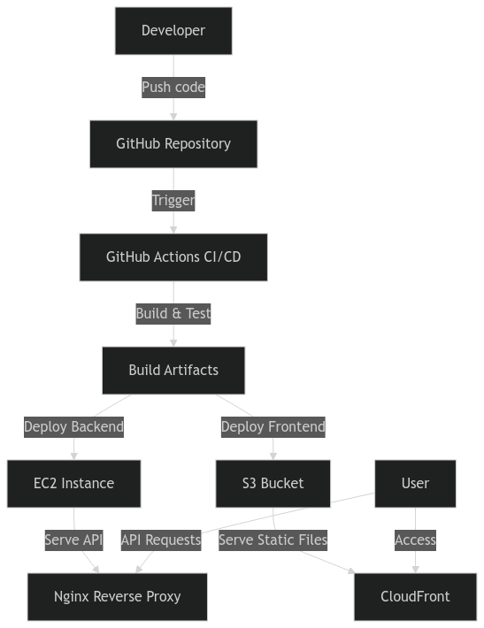
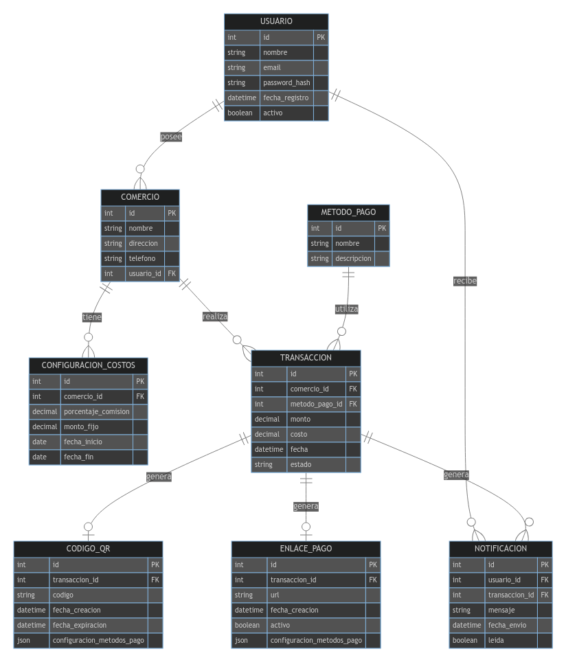
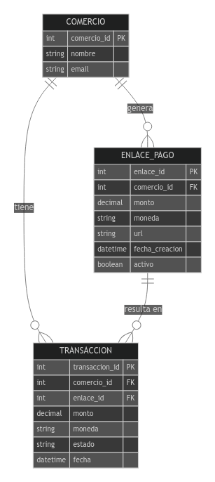

## Índice

0. [Ficha del proyecto](#0-ficha-del-proyecto)
1. [Descripción general del producto](#1-descripción-general-del-producto)
2. [Arquitectura del sistema](#2-arquitectura-del-sistema)
3. [Modelo de datos](#3-modelo-de-datos)
4. [Especificación de la API](#4-especificación-de-la-api)
5. [Historias de usuario](#5-historias-de-usuario)
6. [Tickets de trabajo](#6-tickets-de-trabajo)
7. [Pull requests](#7-pull-requests)

---

## 0. Ficha del proyecto

### **0.1. Tu nombre completo:**

Julián Andrés Salgado López

### **0.2. Nombre del proyecto:**

Quickash

### **0.3. Descripción breve del proyecto:**

Proyecto de desarrollo de una aplicación web para gestionar y recibir pagos de cualquier producto o servicio mediante un código QR o un enlace de pago.

### **0.4. URL del proyecto:**

http://quickash.com.s3-website.us-east-2.amazonaws.com/

### 0.5. URL o archivo comprimido del repositorio

https://github.com/julian5147/AI4Devs-finalproject.git


---

## 1. Descripción general del producto

### **1.1. Objetivo:**

El propósito principal de nuestra aplicación web, Quickash, es simplificar y centralizar el proceso de pago para pequeños y medianos comercios, ofreciendo una solución integral que permite gestionar y recibir pagos de productos o servicios mediante códigos QR o enlaces de pago.

Quickash aporta valor al:

1. Centralizar diversos métodos de pago en una sola plataforma.
2. Agilizar el proceso de cobro para los comerciantes.
3. Ofrecer una experiencia de pago más rápida y conveniente para los clientes.
4. Proporcionar una visión clara y organizada de los flujos de ingresos del negocio.

La aplicación soluciona los siguientes problemas:

1. La complejidad de manejar múltiples plataformas de pago.
2. La lentitud en los procesos de cobro tradicionales.
3. La falta de visibilidad en tiempo real de los pagos recibidos y pendientes.
4. La dificultad para ofrecer opciones de pago flexibles a los clientes.

Quickash está dirigida principalmente a:

- Pequeños y medianos comercios
- Profesionales independientes
- Emprendedores y startups
- Cualquier negocio que busque optimizar su proceso de cobro y gestión de pagos

### **1.2. Características y funcionalidades principales:**

1. **Generación de códigos QR dinámicos:**
   - Creación rápida de códigos QR únicos para cada transacción.
   - Personalización del monto y descripción del pago.
   - Opcón de establecer tiempo de expiración para el código QR.
2. **Creación de enlaces de pago:**
   - Generación de enlaces personalizados para compartir por correo electrónico, SMS o redes sociales.
   - Posibilidad de crear enlaces recurrentes para pagos periódicos.
3. **Panel de control centralizado:**
   - Visualización en tiempo real de todos los pagos recibidos y pendientes.
   - Filtros y búsqueda avanzada para localizar transacciones específicas.
   - Gráficos y estadísticas para analizar el flujo de ingresos.
4. **Integración con múltiples métodos de pago:**
   - Soporte para tarjetas de crédito/débito, transferencias bancarias y billeteras digitales.
   - Fácil configuración de nuevos métodos de pago según las necesidades del negocio.
5. **Gestión de clientes:**
   - Base de datos de clientes con historial de transacciones.
   - Opción para enviar recordatorios de pago automáticos.
6. **Emisión de comprobantes y facturas:**
   - Generación automática de recibos digitales.
   - Creación y envío de facturas personalizadas.
7. **Notificaciones en tiempo real:**
   - Alertas instantáneas para el comerciante cuando se recibe un pago.
   - Notificaciones para los clientes sobre el estado de su transacción.
8. **Seguridad y cumplimiento:**
   - Encriptación de datos de extremo a extremo.
   - Cumplimiento con estándares de seguridad PCI DSS.
   - Autenticación de dos factores para acceder a la cuenta.
9. **Reportes y exportación de datos:**
   - Generación de informes detallados sobre las transacciones.
   - Exportación de datos en múltiples formatos (CSV, Excel, PDF).
10. **Integración con sistemas de contabilidad:**
     - Conexión con software de contabilidad popular para sincronización automática de transacciones.
11. **Aplicación móvil complementaria:**
    - Versión móvil para gestionar pagos y visualizar estadísticas en movimiento.
    - Escáner de códigos QR integrado para facilitar los pagos en persona.
12. **Personalización de la experiencia de pago:**
    - Opción para personalizar la página de pago con el logo y colores de la marca.
    - Creación de plantillas de pago para agilizar transacciones recurrentes.
  
#### **Lean Canvas: Quickash - Plataforma de Gestión de Pagos**

| Problema | Solución | Propuesta de Valor Única | Ventaja Injusta | Segmentos de Clientes |
|----------|----------|--------------------------|-----------------|------------------------|
| - Complejidad en el manejo de múltiples plataformas de pago<br>- Procesos de cobro lentos<br>- Falta de visibilidad en tiempo real de pagos | - Códigos QR dinámicos<br>- Enlaces de pago personalizados<br>- Panel de control centralizado | Centraliza y simplifica la gestión de pagos para negocios, ofreciendo una experiencia rápida y conveniente | - Algoritmos de optimización de pagos patentados<br>- Partnerships estratégicos con proveedores de servicios financieros | - Pequeños y medianos comercios<br>- Profesionales independientes<br>-Emprendedores<br>- Startups |

| Métricas Clave | Canales | Early Adopters |
|----------------|---------|----------------|
| - Tasa de adopción<br>- Volumen de transacciones<br>- Retención de clientes<br>- NPS | - Marketing digital<br>- Partnerships con asociaciones empresariales<br>- Ventas directas | - Negocios tech-savvy<br>- Comercios con alta rotación de clientes |

| Estructura de Costos | Fuentes de Ingresos |
|----------------------|----------------------|
| - Desarrollo y mantenimiento de plataforma<br>- Infraestructura cloud<br>- Equipo de soporte al cliente<br>- Marketing y adquisición de clientes | - Comisiones por transacción<br>- Suscripciones mensuales/anuales<br>- Servicios premium (análisis avanzados, integraciones personalizadas) |

### **1.3. Diseño y experiencia de usuario:**

Videotutorial de la aplicación: https://drive.google.com/file/d/1-10yhVO7hjdFVvQkn6Py_ojfHFlBzesB/view?usp=drive_link

### **1.4. Instrucciones de instalación:**

#### Requisitos previos
- Node.js (versión 18 o superior)
- npm (normalmente viene con Node.js)
- Docker y Docker Compose
- Git

#### Pasos de instalación

1. Clonar el repositorio:
   ```
   git clone https://github.com/julian5147/AI4Devs-finalproject.git
   cd AI4Devs-finalproject
   ```

2. Configurar el backend:
   ```
   cd backend
   cp .env.example .env
   npm install
   ```
   Edita el archivo `.env` con las configuraciones necesarias, especialmente la URL de la base de datos.

3. Configurar el frontend:
   ```
   cd ../frontend
   cp .env.example .env
   npm install
   ```
   Edita el archivo `.env` con la URL del backend.

4. Iniciar la base de datos con Docker:
   ```
   docker-compose up -d
   ```

5. Ejecutar migraciones y semillas de datos:
   ```
   cd ../backend
   npx prisma migrate dev
   npx prisma db seed
   ```

6. Iniciar el backend:
   ```
   npm run start:dev
   ```
   El backend estará disponible en `http://localhost:3010`.

7. Iniciar el frontend (en una nueva terminal):
   ```
   cd ../frontend
   npm start
   ```
   El frontend estará disponible en `http://localhost:3000`.

8. Acceder a la documentación de la API:
   Visita `http://localhost:3010/api` en tu navegador para ver la documentación Swagger.

#### Notas adicionales:
- Para ejecutar pruebas en el backend: `cd backend && npm test`
- Para ejecutar pruebas en el frontend: `cd frontend && npm test`
- Para construir el proyecto para producción:
  - Backend: `cd backend && npm run build`
  - Frontend: `cd frontend && npm run build`

Asegúrate de tener todas las variables de entorno necesarias configuradas en los archivos `.env` tanto para el backend como para el frontend.

---

## 2. Arquitectura del Sistema

### **2.1. Diagrama de arquitectura:**



### Explicación de la arquitectura:

1. **Patrón arquitectónico**: Esta arquitectura sigue el patrón de Microservicios. Cada componente funcional principal se ha diseñado como un servicio independiente.

2. **Justificación de la elección**:
   - Escalabilidad independiente de cada servicio.
   - Desarrollo y despliegue independientes, permitiendo una entrega continua más eficiente.
   - Aislamiento de fallos, mejorando la resiliencia general del sistema.
   - Flexibilidad para usar diferentes tecnologías en cada servicio según sea necesario.

3. **Componentes principales**:
   - API Gateway: Punto de entrada único para todas las solicitudes de clientes.
   - Servicios independientes para Autenticación, Pagos, Códigos QR, Enlaces de Pago, Notificaciones y Análisis.
   - Base de datos: Posiblemente utilizando el patrón Database per Service.
   - Cola de mensajes: Para comunicación asíncrona entre servicios.

4. **Beneficios principales**:
   - Alta cohesión y bajo acoplamiento entre servicios.
   - Facilita la implementación de CI/CD para cada servicio.
   - Permite escalar horizontalmente los servicios más demandados.
   - Mejora la resiliencia general del sistema.

5. **Sacrificios o limitaciones**:
   - Mayor complejidad operativa.
   - Desafíos en la gestión de transacciones distribuidas.
   - Posible latencia adicional debido a la comunicación entre servicios.
   - Necesidad de implementar mecanismos robustos de observabilidad y monitoreo.

### Tecnologías sugeridas:

- API Gateway: Puede implementarse con tecnologías como Kong, AWS API Gateway o Nginx.
- Servicios: Pueden desarrollarse en lenguajes como Node.js, Python o Go, dependiendo de las necesidades específicas de cada servicio.
- Base de datos: Podría utilizarse una combinación de bases de datos SQL (como PostgreSQL) para datos transaccionales y NoSQL (como MongoDB) para datos no estructurados o que requieran alta escalabilidad.
- Cola de mensajes: Tecnologías como RabbitMQ o Apache Kafka serían adecuadas.
- Infraestructura Cloud: Puede desplegarse en proveedores como AWS, Google Cloud o Azure, aprovechando sus servicios gestionados para reducir la carga operativa.

Esta arquitectura proporciona una base sólida para Quickash, permitiendo un desarrollo ágil, escalabilidad y mantenimiento eficiente a largo plazo. La separación de responsabilidades en servicios independientes facilita la evolución del sistema y la incorporación de nuevas funcionalidades en el futuro.

### **2.2. Descripción de componentes principales:**

1. **API Gateway**
   - Tecnología: Kong o AWS API Gateway
   - Descripción: Actúa como punto de entrada único para todas las solicitudes de clientes, gestionando la autenticación, el enrutamiento y el balanceo de carga.

2. **Servicio de Autenticación**
   - Tecnología: Node.js con Express.js y JSON Web Tokens (JWT)
   - Descripción: Maneja el registro de usuarios, inicio de sesión y gestión de tokens de autenticación.

3. **Servicio de Pagos**
   - Tecnología: Go (Golang)
   - Descripción: Procesa las transacciones de pago, integrándose con diversos proveedores de pago y gestionando la lógica de negocio relacionada con los pagos.

4. **Servicio de Códigos QR**
   - Tecnología: Python con Flask
   - Descripción: Genera y gestiona códigos QR dinámicos para pagos.

5. **Servicio de Enlaces de Pago**
   - Tecnología: Node.js con Express.js
   - Descripción: Crea y gestiona enlaces de pago personalizados.

6. **Servicio de Notificaciones**
   - Tecnología: Node.js con Socket.io para notificaciones en tiempo real
   - Descripción: Envía notificaciones a usuarios sobre el estado de sus transacciones y otros eventos importantes.

7. **Servicio de Análisis**
   - Tecnología: Python con pandas y scikit-learn para análisis de datos
   - Descripción: Procesa y analiza datos de transacciones para generar informes y estadísticas.

8. **Base de Datos**
   - Tecnología: PostgreSQL para datos transaccionales, MongoDB para datos no estructurados
   - Descripción: Almacena datos de usuarios, transacciones y otra información crítica del sistema.

9. **Cola de Mensajes**
   - Tecnología: RabbitMQ
   - Descripción: Facilita la comunicación asíncrona entre servicios, mejorando la escalabilidad y la resiliencia del sistema.

10. **Frontend**
    - Tecnología: React.js con Next.js para renderizado del lado del servidor
    - Descripción: Interfaz de usuario responsive y dinámica para clientes web.

11. **Aplicación Móvil**
    - Tecnología: React Native
    - Descripción: Aplicación móvil multiplataforma para iOS y Android.

12. **Infraestructura Cloud**
    - Tecnología: AWS (Amazon Web Services) o Google Cloud Platform
    - Descripción: Proporciona servicios de computación, almacenamiento y red escalables y seguros.

### **2.3. Descripción de alto nivel del proyecto y estructura de ficheros**

El proyecto Quickash sigue una arquitectura de microservicios, con una clara separación entre el frontend y el backend. La estructura general del proyecto es la siguiente:

```
quickash/
├── frontend/
│   ├── public/
│   ├── src/
│   │   ├── components/
│   │   ├── pages/
│   │   ├── store/
│   │   ├── services/
│   │   └── App.tsx
│   ├── package.json
│   └── Dockerfile
├── backend/
│   ├── src/
│   │   ├── auth/
│   │   ├── merchants/
│   │   ├── payment-links/
│   │   ├── transactions/
│   │   └── main.ts
│   ├── prisma/
│   ├── test/
│   ├── package.json
│   └── Dockerfile
├── docker-compose.yml
└── README.md
```

#### Frontend (React)

El frontend está construido con React y sigue una arquitectura basada en componentes. Utiliza Redux para la gestión del estado global y React Router para la navegación.

- `public/`: Contiene archivos estáticos y el archivo HTML principal.
- `src/`: Contiene todo el código fuente de la aplicación React.
  - `components/`: Componentes reutilizables de React.
  - `pages/`: Componentes que representan páginas completas.
  - `store/`: Configuración de Redux y slices para la gestión del estado.
  - `services/`: Servicios para interactuar con la API del backend.
- `App.tsx`: Componente principal de la aplicación.
- `Dockerfile`: Configuración para construir la imagen Docker del frontend.

El frontend sigue el patrón de diseño de Presentación-Contenedor, separando la lógica de presentación de la lógica de negocio.

#### Backend (NestJS)

El backend está construido con NestJS, un framework de Node.js que sigue los principios de la arquitectura modular y la inyección de dependencias.

- `src/`: Contiene todo el código fuente del backend.
  - `auth/`: Módulo de autenticación.
  - `merchants/`: Módulo para la gestión de comerciantes.
  - `payment-links/`: Módulo para la gestión de enlaces de pago.
  - `transactions/`: Módulo para la gestión de transacciones.
  - `main.ts`: Punto de entrada de la aplicación NestJS.
- `prisma/`: Contiene el schema de Prisma y las migraciones de la base de datos.
- `test/`: Contiene pruebas unitarias y de integración.
- `Dockerfile`: Configuración para construir la imagen Docker del backend.

El backend sigue el patrón de arquitectura de Módulos de NestJS, que promueve la separación de preocupaciones y la modularidad.

#### Arquitectura general

El proyecto sigue una arquitectura de microservicios, con el frontend y el backend como servicios separados. Esto se refleja en la estructura de archivos y en la presencia de Dockerfiles individuales para cada servicio.

El archivo `docker-compose.yml` en la raíz del proyecto define cómo estos servicios se relacionan entre sí y con otros servicios como la base de datos.

Esta estructura permite:
1. Desarrollo independiente de frontend y backend.
2. Escalabilidad independiente de cada servicio.
3. Fácil integración de nuevos servicios en el futuro.
4. Despliegue simplificado utilizando contenedores Docker.

La arquitectura general sigue los principios de Diseño Orientado al Dominio (DDD) en el backend, con una clara separación de las capas de presentación, lógica de negocio y acceso a datos.
> Representa la estructura del proyecto y explica brevemente el propósito de las carpetas principales, así como si obedece a algún patrón o arquitectura específica.

### **2.4. Infraestructura y despliegue**

Para detallar la infraestructura del proyecto Quickash y explicar el proceso de despliegue, podemos utilizar un diagrama de arquitectura y una descripción del flujo de despliegue. Aquí está una propuesta:

### 2.4. Infraestructura y despliegue

#### Diagrama de infraestructura



#### Explicación de la infraestructura

1. **GitHub Repository**: Almacena el código fuente del proyecto.
2. **GitHub Actions CI/CD**: Automatiza el proceso de build, test y despliegue.
3. **EC2 Instance**: Ejecuta el backend de la aplicación.
4. **S3 Bucket**: Aloja los archivos estáticos del frontend.
5. **CloudFront**: Distribuye el contenido del frontend globalmente.
6. **Nginx Reverse Proxy**: Gestiona las solicitudes entrantes al backend.

#### Proceso de despliegue

1. **Desarrollo y push de código**:
   Los desarrolladores trabajan en sus ramas locales y crean pull requests hacia la rama principal.

2. **Trigger del pipeline**:
   Cuando se crea un pull request hacia la rama principal, se activa el pipeline de CI/CD en GitHub Actions.

3. **Build y test**:
   El pipeline ejecuta los siguientes pasos para el backend:
    - Instalación de dependencias
    - Ejecución de tests

4. **Despliegue del backend**:
   Si los tests pasan, el pipeline despliega el backend en una instancia EC2:

   Este proceso incluye:
   - Configuración de variables de entorno
   - Instalación y configuración de Nginx como reverse proxy
   - Instalación de dependencias
   - Ejecución de migraciones de base de datos
   - Inicio de la aplicación usando PM2

5. **Despliegue del frontend**:
   Después del despliegue exitoso del backend, el pipeline despliega el frontend:

   Este proceso incluye:
   - Construcción de los archivos estáticos del frontend
   - Sincronización de los archivos con un bucket S3
   - Invalidación de la caché de CloudFront

6. **Configuración de seguridad**:
   - Se utilizan secretos de GitHub Actions para manejar información sensible como claves SSH y credenciales de AWS.
   - La comunicación entre el frontend y el backend se realiza a través de HTTPS.

7. **Monitoreo y logs**:
   - PM2 se utiliza para gestionar el proceso del backend, proporcionando logs y monitoreo básico.
   - Los logs de acceso de Nginx pueden utilizarse para monitorear las solicitudes entrantes.
   - CloudWatch puede configurarse para monitorear la instancia EC2 y el bucket S3.

Este proceso de despliegue automatizado permite una entrega continua de nuevas características y correcciones de bugs, manteniendo la estabilidad y confiabilidad del sistema. La infraestructura en AWS proporciona escalabilidad y alta disponibilidad para manejar el crecimiento futuro de Quickash.

### **2.5. Seguridad**

1. **Autenticación basada en JWT (JSON Web Tokens)**
   - Se utiliza JWT para autenticar a los usuarios y proteger las rutas.
   - Ejemplo de implementación en el backend:


```10:12:backend/src/main.ts
  app.enableCors();
  app.useGlobalPipes(new ValidationPipe());
  app.useGlobalFilters(new HttpExceptionFilter());
```


2. **Validación de datos de entrada**
   - Se utiliza el módulo `class-validator` para validar los datos de entrada en los DTOs.
   - Ejemplo de un DTO con validaciones:

```typescript
import { IsNotEmpty, IsEmail, MinLength } from 'class-validator';

export class CreateMerchantDto {
  @IsNotEmpty()
  name: string;

  @IsEmail()
  email: string;

  @MinLength(8)
  password: string;
}
```

3. **Hashing de contraseñas**
   - Las contraseñas se almacenan hasheadas utilizando bcrypt.
   - Ejemplo de implementación:

```typescript
import * as bcrypt from 'bcrypt';

async function hashPassword(password: string): Promise<string> {
  const saltRounds = 10;
  return bcrypt.hash(password, saltRounds);
}
```

4. **CORS (Cross-Origin Resource Sharing)**
   - Se ha configurado CORS para controlar qué dominios pueden acceder a la API.
   - Implementación en el archivo main.ts:


```10:10:backend/src/main.ts
  app.enableCors();
```


5. **Manejo de excepciones global**
   - Se utiliza un filtro de excepciones global para manejar y formatear los errores de manera consistente.
   - Implementación:


```12:12:backend/src/main.ts
  app.useGlobalFilters(new HttpExceptionFilter());
```


6. **Variables de entorno**
   - Las configuraciones sensibles se manejan a través de variables de entorno.
   - Ejemplo de uso en el archivo de configuración de Prisma:


```11:14:backend/prisma/schema.prisma
datasource db {
  provider = "postgresql"
  url      = env("DATABASE_URL")
}
```


7. **Validación de tipos con TypeScript**
   - El uso de TypeScript ayuda a prevenir errores de tipo en tiempo de compilación.

8. **Pruebas de seguridad**
   - Se han implementado pruebas e2e que incluyen escenarios de seguridad.
   - Ejemplo de una prueba que verifica la autenticación:


```19:24:backend/test/app.e2e-spec.ts
    const loginResponse = await request(app.getHttpServer())
      .post('/auth/login')
      .send({ email: 'test@example.com', password: 'testpassword' })
      .expect(200);
      .expect('Hello World!');
    jwtToken = loginResponse.body.access_token;
```


9. **Documentación de API segura**
   - Se utiliza Swagger para documentar la API, lo que ayuda a prevenir el uso incorrecto.
   - Configuración en main.ts:


```14:22:backend/src/main.ts
  const config = new DocumentBuilder()
    .setTitle('Quickash API')
    .setDescription('API for managing payment links and transactions')
    .setVersion('1.0')
    .addTag('payment-links')
    .addTag('transactions')
    .build();
  const document = SwaggerModule.createDocument(app, config);
  SwaggerModule.setup('api', app, document);
```


10. **Principio de mínimo privilegio**
    - Los endpoints están protegidos y solo accesibles por usuarios autenticados y autorizados.

11. **Logging seguro**
    - Se utiliza Winston para el logging, asegurando que no se registren datos sensibles.

12. **Actualizaciones regulares de dependencias**
    - Se mantienen las dependencias actualizadas para prevenir vulnerabilidades conocidas.

### **2.6. Tests**

En el proyecto Quickash, se han implementado varios tipos de tests para asegurar la calidad y el correcto funcionamiento del código. A continuación, se describen algunos de los tests más relevantes:

1. **Tests de integración (E2E)**

Estos tests verifican el funcionamiento de la aplicación de extremo a extremo, simulando las interacciones reales de los usuarios con la API.

Ejemplo de test E2E para la creación de un enlace de pago:


```27:41:backend/test/app.e2e-spec.ts
  it('/payment-links (POST)', () => {
    return request(app.getHttpServer())
      .post('/payment-links')
      .set('Authorization', `Bearer ${jwtToken}`)
      .send({
        merchantId: 2,
        amount: 100,
        currency: 'USD',
      })
      .expect(201)
      .expect((res) => {
        expect(res.body).toHaveProperty('id');
        expect(res.body).toHaveProperty('url');
      });
      });
```


Este test verifica que:
- Se puede crear un enlace de pago correctamente.
- La respuesta tiene el código de estado 201 (Created).
- La respuesta incluye las propiedades 'id' y 'url' del enlace de pago creado.

2. **Tests unitarios de servicios**

Estos tests se centran en verificar el funcionamiento correcto de los servicios individuales de la aplicación.

Ejemplo de test unitario para el servicio de enlaces de pago:


```34:59:backend/src/payment-links/payment-links.service.spec.ts
  describe('create', () => {
    it('should create a payment link', async () => {
      const createPaymentLinkDto = {
        merchantId: 1,
        amount: 100,
        currency: 'USD',
      };
      };
      const expectedResult = {
        id: 1,
        ...createPaymentLinkDto,
        url: 'http://example.com/pay/1',
        createdAt: new Date(),
        updatedAt: new Date(),
        active: true,
        amount: new Decimal(createPaymentLinkDto.amount),
      };
      };
      jest
        .spyOn(prismaService.paymentLink, 'create')
        .mockResolvedValue(expectedResult);
        .mockResolvedValue(expectedResult);
      const result = await service.create(createPaymentLinkDto);
      expect(result).toEqual(expectedResult);
    });
    });
```


Este test verifica que:
- El método `create` del servicio `PaymentLinksService` funciona correctamente.
- Se crea un enlace de pago con los datos proporcionados.
- El resultado incluye todas las propiedades esperadas del enlace de pago.

3. **Tests unitarios de controladores**

Estos tests verifican el correcto funcionamiento de los controladores, que son responsables de manejar las solicitudes HTTP.

Ejemplo de test unitario para el controlador de transacciones:


```32:55:backend/src/transactions/transactions.controller.spec.ts
  describe('create', () => {
    it('should create a transaction', async () => {
      const createTransactionDto = {
        paymentLinkId: 1,
        amount: 100,
        currency: 'USD',
        merchantId: 1,
      };
      };
      const expectedResult = {
        id: 1,
        ...createTransactionDto,
        status: 'completed',
        createdAt: new Date(),
        updatedAt: new Date(),
        amount: new Decimal(createTransactionDto.amount),
      };
      };
      jest.spyOn(service, 'create').mockResolvedValue(expectedResult);
      jest.spyOn(service, 'create').mockResolvedValue(expectedResult);
      const result = await controller.create(createTransactionDto);
      expect(result).toEqual(expectedResult);
    });
    });
```


Este test verifica que:
- El método `create` del controlador `TransactionsController` funciona correctamente.
- Se crea una transacción con los datos proporcionados.
- El resultado coincide con la transacción esperada.

4. **Tests de autenticación**

Se han implementado tests para verificar el correcto funcionamiento del sistema de autenticación basado en JWT.

Ejemplo de test de autenticación (parte del test E2E):


```18:24:backend/test/app.e2e-spec.ts
    // Login to get JWT token
    const loginResponse = await request(app.getHttpServer())
      .post('/auth/login')
      .send({ email: 'test@example.com', password: 'testpassword' })
      .expect(200);
      .expect('Hello World!');
    jwtToken = loginResponse.body.access_token;
```


Este test verifica que:
- Se puede realizar un login exitoso.
- Se obtiene un token JWT válido como respuesta.

Estos tests ayudan a asegurar que las diferentes partes de la aplicación Quickash funcionan correctamente de forma individual y en conjunto, proporcionando una base sólida para el desarrollo continuo y la detección temprana de posibles errores.

---

## 3. Modelo de Datos

### **3.1. Diagrama del modelo de datos:**




### **3.2. Descripción de entidades principales:**

1. USUARIO
   - id (int, PK): Identificador único del usuario.
   - nombre (string, not null): Nombre completo del usuario.
   - email (string, unique, not null): Correo electrónico del usuario, usado para autenticación.
   - password_hash (string, not null): Hash de la contraseña del usuario para seguridad.
   - fecha_registro (datetime, not null): Fecha y hora de registro del usuario.
   - activo (boolean, not null): Indica si la cuenta del usuario está activa.

   Relaciones:
   - Uno a muchos con COMERCIO (un usuario puede tener múltiples comercios).
   - Uno a muchos con NOTIFICACION (un usuario puede recibir múltiples notificaciones).

2. COMERCIO
   - id (int, PK): Identificador único del comercio.
   - nombre (string, not null): Nombre del comercio.
   - direccion (string): Dirección física del comercio.
   - telefono (string): Número de teléfono de contacto del comercio.
   - usuario_id (int, FK, not null): Referencia al USUARIO propietario del comercio.

   Relaciones:
   - Muchos a uno con USUARIO (un comercio pertenece a un usuario).
   - Uno a muchos con TRANSACCION (un comercio puede tener múltiples transacciones).
   - Uno a muchos con CONFIGURACION_COSTOS (un comercio puede tener múltiples configuraciones de costos).

3. CONFIGURACION_COSTOS
   - id (int, PK): Identificador único de la configuración de costos.
   - comercio_id (int, FK, not null): Referencia al COMERCIO al que pertenece esta configuración.
   - porcentaje_comision (decimal, not null): Porcentaje de comisión aplicado a las transacciones.
   - monto_fijo (decimal, not null): Monto fijo aplicado a las transacciones.
   - fecha_inicio (date, not null): Fecha de inicio de validez de esta configuración.
   - fecha_fin (date): Fecha de fin de validez de esta configuración.

   Relaciones:
   - Muchos a uno con COMERCIO (una configuración de costos pertenece a un comercio).

4. METODO_PAGO
   - id (int, PK): Identificador único del método de pago.
   - nombre (string, not null): Nombre del método de pago.
   - descripcion (string): Descripción detallada del método de pago.

   Relaciones:
   - Uno a muchos con TRANSACCION (un método de pago puede ser utilizado en múltiples transacciones).

5. TRANSACCION
   - id (int, PK): Identificador único de la transacción.
   - comercio_id (int, FK, not null): Referencia al COMERCIO que realiza la transacción.
   - metodo_pago_id (int, FK, not null): Referencia al METODO_PAGO utilizado.
   - monto (decimal, not null): Monto de la transacción.
   - costo (decimal, not null): Costo asociado a la transacción (comisiones, etc.).
   - fecha (datetime, not null): Fecha y hora de la transacción.
   - estado (string, not null): Estado actual de la transacción (ej: pendiente, completada, cancelada).

   Relaciones:
   - Muchos a uno con COMERCIO (una transacción pertenece a un comercio).
   - Muchos a uno con METODO_PAGO (una transacción utiliza un método de pago).
   - Uno a uno con CODIGO_QR (una transacción puede generar un código QR).
   - Uno a uno con ENLACE_PAGO (una transacción puede generar un enlace de pago).
   - Uno a muchos con NOTIFICACION (una transacción puede generar múltiples notificaciones).

6. CODIGO_QR
   - id (int, PK): Identificador único del código QR.
   - transaccion_id (int, FK, not null): Referencia a la TRANSACCION asociada.
   - codigo (string, not null): Código QR generado.
   - fecha_creacion (datetime, not null): Fecha y hora de creación del código QR.
   - fecha_expiracion (datetime): Fecha y hora de expiración del código QR.
   - configuracion_metodos_pago (json): Configuración de métodos de pago permitidos para este código QR.

   Relaciones:
   - Uno a uno con TRANSACCION (un código QR está asociado a una transacción).

7. ENLACE_PAGO
   - id (int, PK): Identificador único del enlace de pago.
   - transaccion_id (int, FK, not null): Referencia a la TRANSACCION asociada.
   - url (string, not null): URL del enlace de pago.
   - fecha_creacion (datetime, not null): Fecha y hora de creación del enlace.
   - activo (boolean, not null): Indica si el enlace está activo.
   - configuracion_metodos_pago (json): Configuración de métodos de pago permitidos para este enlace.

   Relaciones:
   - Uno a uno con TRANSACCION (un enlace de pago está asociado a una transacción).

8. NOTIFICACION
   - id (int, PK): Identificador único de la notificación.
   - usuario_id (int, FK, not null): Referencia al USUARIO que recibe la notificación.
   - transaccion_id (int, FK, not null): Referencia a la TRANSACCION que genera la notificación.
   - mensaje (string, not null): Contenido de la notificación.
   - fecha_envio (datetime, not null): Fecha y hora de envío de la notificación.
   - leida (boolean, not null): Indica si la notificación ha sido leída por el usuario.

   Relaciones:
   - Muchos a uno con USUARIO (una notificación es recibida por un usuario).
   - Muchos a uno con TRANSACCION (una notificación es generada por una transacción).

### **3.3. Diagrama del modelo de datos MVP:**



Este diagrama representa un modelo de datos simplificado que cubre las funcionalidades principales del MVP:

1. **COMERCIO**: Representa al usuario del sistema que genera enlaces de pago y recibe pagos.
2. **ENLACE_PAGO**: Almacena la información de los enlaces de pago generados por los comercios.
3. **TRANSACCION**: Registra los pagos realizados a través de los enlaces de pago.

Las relaciones entre estas entidades son:

- Un COMERCIO puede generar múltiples ENLACE_PAGO (relación uno a muchos).
- Un COMERCIO puede tener múltiples TRANSACCION (relación uno a muchos).
- Un ENLACE_PAGO puede resultar en múltiples TRANSACCION (relación uno a muchos), aunque típicamente será una sola.

Este modelo simplificado permite:

1. Generar links de pago (creando registros en ENLACE_PAGO).
2. Crear pagos (registrando TRANSACCION).
3. Permitir que el comercio vea sus pagos (consultando TRANSACCION filtrado por comercio_id).
---

## 4. Especificación de la API

https://app.swaggerhub.com/apis-docs/JULISALGADO71_1/Quickash/1.0.0

Ejemplos de petición y respuesta para cada endpoint:

1. Crear un nuevo enlace de pago (Create a new payment link)

Petición:
```http
POST /payment-links HTTP/1.1
Host: api.quickash.com
Content-Type: application/json

{
  "merchant_id": 123,
  "amount": 100.50,
  "currency": "USD"
}
```

Respuesta:
```http
HTTP/1.1 201 Created
Content-Type: application/json

{
  "id": 456,
  "merchant_id": 123,
  "amount": 100.50,
  "currency": "USD",
  "url": "https://quickash.com/pay/456",
  "created_at": "2023-05-15T10:30:00Z",
  "active": true
}
```

2. Crear una nueva transacción (Create a new transaction)

Petición:
```http
POST /transactions HTTP/1.1
Host: api.quickash.com
Content-Type: application/json

{
  "payment_link_id": 456
}
```

Respuesta:
```http
HTTP/1.1 201 Created
Content-Type: application/json

{
  "id": 789,
  "merchant_id": 123,
  "payment_link_id": 456,
  "amount": 100.50,
  "currency": "USD",
  "status": "completed",
  "created_at": "2023-05-15T11:00:00Z"
}
```

3. Obtener transacciones de un comercio (Get transactions for a merchant)

Petición:
```http
GET /merchants/123/transactions HTTP/1.1
Host: api.quickash.com
```

Respuesta:
```http
HTTP/1.1 200 OK
Content-Type: application/json

[
  {
    "id": 789,
    "merchant_id": 123,
    "payment_link_id": 456,
    "amount": 100.50,
    "currency": "USD",
    "status": "completed",
    "created_at": "2023-05-15T11:00:00Z"
  },
  {
    "id": 790,
    "merchant_id": 123,
    "payment_link_id": 457,
    "amount": 75.00,
    "currency": "USD",
    "status": "completed",
    "created_at": "2023-05-16T09:30:00Z"
  }
]
```

Esta especificación de API proporciona una base sólida para el MVP de Quickash, permitiendo la creación de enlaces de pago, el registro de transacciones y la consulta de transacciones por comercio. La API se ha diseñado siguiendo las mejores prácticas de REST y utiliza JSON para el intercambio de datos.

---

## 5. Historias de Usuario

**Historia de Usuario 1: Crear enlace de pago**

Como vendedor en línea,
Quiero crear un enlace de pago personalizado para un producto o servicio,
Para poder compartirlo con mis clientes y recibir pagos de forma remota.

Criterios de aceptación:
- El sistema debe permitir ingresar el monto del pago y la moneda.
- Se debe generar un URL único y corto para cada enlace de pago.
- El enlace generado debe ser válido y accesible desde cualquier dispositivo.
- El sistema debe mostrar una confirmación con el enlace generado y opciones para copiarlo o compartirlo.
- El enlace debe llevar a una página de pago segura con la información del monto y moneda especificados.

**Historia de Usuario 2: Procesar pago a través de enlace**

Como cliente de un comercio,
Quiero realizar un pago a través de un enlace que he recibido,
Para completar mi compra de forma rápida y segura.

Criterios de aceptación:
- Al acceder al enlace, se debe mostrar claramente el monto a pagar y el nombre del comercio.
- El sistema debe ofrecer al menos un método de pago seguro (por ejemplo, tarjeta de crédito).
- El proceso de pago debe ser intuitivo y requerir la mínima información necesaria.
- Tras completar el pago, se debe mostrar una confirmación clara del éxito de la transacción.
- El sistema debe enviar una notificación al comercio informando sobre el pago realizado.

**Historia de Usuario 3: Visualizar transacciones del comercio**

Como dueño de un negocio,
Quiero ver un resumen de todas las transacciones realizadas a través de mis enlaces de pago,
Para llevar un control de mis ingresos y el estado de los pagos.

Criterios de aceptación:
- El panel debe mostrar una lista de transacciones con fecha, monto, estado y enlace de pago asociado.
- Se debe poder filtrar las transacciones por fecha y estado (completado, pendiente, fallido).
- El sistema debe mostrar el total de ingresos para el período seleccionado.
- Cada transacción debe tener un detalle expandible con información adicional.
- Se debe ofrecer la opción de exportar la lista de transacciones en formato CSV.
  
---

## 6. Tickets de Trabajo

> Documenta 3 de los tickets de trabajo principales del desarrollo, uno de backend, uno de frontend, y uno de bases de datos. Da todo el detalle requerido para desarrollar la tarea de inicio a fin teniendo en cuenta las buenas prácticas al respecto. 

Título: Implementar API REST para la gestión de enlaces de pago y transacciones

Descripción:
Desarrollar los endpoints necesarios para crear enlaces de pago, procesar pagos y obtener transacciones de un comercio utilizando NestJS.

Tareas:
1. Configurar proyecto NestJS con TypeScript
2. Implementar módulos para enlaces de pago y transacciones
3. Crear DTOs para validación de entrada
4. Desarrollar servicios para la lógica de negocio
5. Implementar controladores para los endpoints REST
6. Integrar Prisma como ORM para interactuar con la base de datos
7. Implementar manejo de errores y excepciones
8. Configurar validación de datos con class-validator
9. Implementar autenticación JWT para los endpoints que lo requieran
10. Escribir pruebas unitarias y de integración

Criterios de aceptación:
- Los endpoints deben seguir las especificaciones de la API definidas en el OpenAPI
- El código debe seguir los principios SOLID y las mejores prácticas de NestJS
- Debe haber una cobertura de pruebas de al menos 80%
- La autenticación debe estar implementada correctamente
- El código debe pasar el linter sin errores

Estimación: 13 puntos

Prioridad: Alta

Etiquetas: backend, nestjs, api, mvp

2. **Ticket 2**:

Título: Desarrollar interfaz de usuario para creación de enlaces de pago y visualización de transacciones

Descripción:
Crear los componentes React necesarios para que los usuarios puedan generar enlaces de pago y ver sus transacciones.

Tareas:
1. Configurar proyecto React con TypeScript y Create React App
2. Implementar enrutamiento con React Router
3. Crear componente para el formulario de creación de enlaces de pago
4. Desarrollar componente para mostrar la lista de transacciones
5. Implementar llamadas a la API utilizando Axios o Fetch
6. Crear componentes reutilizables (botones, inputs, tablas)
7. Implementar manejo de estado global con Redux o Context API
8. Añadir validación de formularios con Formik o React Hook Form
9. Implementar diseño responsive utilizando CSS Modules o Styled Components
10. Escribir pruebas unitarias con Jest y React Testing Library

Criterios de aceptación:
- La interfaz debe ser intuitiva y fácil de usar
- Debe ser responsive y funcionar correctamente en dispositivos móviles y de escritorio
- Los formularios deben tener validación adecuada
- Debe haber retroalimentación visual para acciones del usuario (loading, errores, éxito)
- El código debe seguir las mejores prácticas de React y patrones de diseño adecuados
- Debe haber una cobertura de pruebas de al menos 70%

Estimación: 8 puntos

Prioridad: Alta

Etiquetas: frontend, react, ui, mvp

**Ticket 3**:

Título: Configurar base de datos PostgreSQL, Prisma ORM y entorno Docker

Descripción:
Establecer la estructura de la base de datos para enlaces de pago y transacciones, configurar Prisma como ORM y preparar el entorno de desarrollo con Docker.

Tareas:
1. Diseñar el esquema de la base de datos para enlaces de pago y transacciones
2. Configurar Prisma y crear el schema.prisma inicial
3. Implementar migraciones de base de datos con Prisma
4. Crear Dockerfile para el backend (NestJS)
5. Crear Dockerfile para el frontend (React)
6. Desarrollar docker-compose.yml para orquestar los servicios (backend, frontend, base de datos)
7. Configurar volúmenes para persistencia de datos
8. Implementar variables de entorno para configuración
9. Crear scripts para inicialización y seed de la base de datos
10. Documentar el proceso de configuración y ejecución del entorno

Criterios de aceptación:
- El esquema de la base de datos debe reflejar correctamente las entidades y relaciones del MVP
- Prisma debe estar correctamente configurado y las migraciones deben funcionar sin errores
- Los Dockerfiles deben seguir las mejores prácticas y optimizaciones
- El docker-compose.yml debe permitir levantar todo el entorno con un solo comando
- Debe haber documentación clara sobre cómo configurar y ejecutar el entorno de desarrollo

Estimación: 5 puntos

Prioridad: Alta

Etiquetas: database, postgresql, prisma, docker, infrastructure, mvp

---

## 7. Pull Requests

**Pull Request 1**

# Implementación inicial de la arquitectura y documentación del proyecto Quickash

## Descripción

Este Pull Request establece la base del proyecto Quickash, una aplicación web para gestionar y recibir pagos mediante códigos QR o enlaces de pago. Se ha implementado la estructura inicial del proyecto, incluyendo la arquitectura del sistema, el modelo de datos, y la documentación principal.

### Cambios principales:

- Definición de la arquitectura del sistema basada en microservicios
- Diseño del modelo de datos con entidades principales
- Especificación inicial de la API
- Documentación de historias de usuario y tickets de trabajo
- Actualización del README con la descripción general del producto

## Motivación y contexto

Este PR sienta las bases para el desarrollo futuro de Quickash, proporcionando una estructura clara y documentación detallada que guiará el trabajo del equipo. La arquitectura de microservicios elegida permitirá una mayor escalabilidad y flexibilidad a medida que el proyecto crezca.

## Cómo se ha probado

- Se ha revisado la coherencia de la documentación
- Se ha validado el modelo de datos con expertos en el dominio
- Se ha verificado que la especificación de la API cubre los casos de uso principales

## Notas adicionales

Este PR establece la estructura inicial del proyecto. Se requerirá trabajo adicional para implementar las funcionalidades descritas en la documentación.

**Pull Request 2**

# Pull Request: Implementación de funcionalidades clave para Quickash MVP

## Descripción

Este Pull Request implementa las funcionalidades principales del MVP (Producto Mínimo Viable) para Quickash, nuestra plataforma de gestión de pagos mediante códigos QR y enlaces de pago. Se han desarrollado componentes esenciales tanto en el backend como en el frontend, junto con la configuración necesaria de la base de datos y la infraestructura.

## Cambios principales

### Backend (NestJS)

1. Implementación de módulos para:
   - Autenticación de comerciantes
   - Gestión de enlaces de pago
   - Procesamiento de transacciones

2. Integración de Prisma ORM para interactuar con la base de datos PostgreSQL.

3. Implementación de autenticación JWT para proteger las rutas de la API.

4. Configuración de validación de datos de entrada utilizando class-validator.

### Frontend (React)

1. Creación de componentes para:
   - Página de transacciones
   - Lista de transacciones
   - Formulario de creación de enlaces de pago

2. Implementación de llamadas a la API del backend utilizando Axios.

3. Configuración de manejo de estado global con Redux.

4. Implementación de enrutamiento con React Router.

### Base de datos

1. Configuración de PostgreSQL como base de datos principal.

2. Creación de esquemas y migraciones iniciales utilizando Prisma, incluyendo tablas para:
   - Comerciantes
   - Enlaces de pago
   - Transacciones

### Infraestructura

1. Configuración de Docker y docker-compose para facilitar el despliegue y desarrollo.

2. Creación de Dockerfiles para el backend y frontend.

## Archivos clave modificados

### Backend

```typescript:backend/src/main.ts
app.enableCors();
app.useGlobalPipes(new ValidationPipe());
app.useGlobalFilters(new HttpExceptionFilter());
```

Este fragmento muestra la configuración de CORS, validación global y manejo de excepciones en el backend.

```typescript:backend/src/payment-links/payment-links.service.spec.ts
describe('create', () => {
    it('should create a payment link', async () => {
      const createPaymentLinkDto = {
        merchantId: 1,
        amount: 100,
        currency: 'USD',
      };

      const expectedResult = {
        id: 1,
        ...createPaymentLinkDto,
        url: 'http://example.com/pay/1',
        createdAt: new Date(),
        updatedAt: new Date(),
        active: true,
        amount: new Decimal(createPaymentLinkDto.amount),
      };

      jest
        .spyOn(prismaService.paymentLink, 'create')
        .mockResolvedValue(expectedResult);

      const result = await service.create(createPaymentLinkDto);
      expect(result).toEqual(expectedResult);
    });
  });
});
```

Este bloque de código representa una prueba unitaria para el servicio de enlaces de pago.

### Frontend


```1:42:frontend/src/pages/Transactions.tsx
import React, { useEffect } from 'react';
import { useDispatch, useSelector } from 'react-redux';
import styled from 'styled-components';
import TransactionList from '../components/TransactionList';
import { fetchTransactions } from '../store/transactionsSlice';
import { AppDispatch, RootState } from '../store/store';

const TransactionsContainer = styled.div`
  padding: 20px;
`;

const Title = styled.h1`
  color: #333;
`;

const Transactions: React.FC = () => {
  const dispatch = useDispatch<AppDispatch>();
  const { transactions, status, error } = useSelector((state: RootState) => state.transactions);

  useEffect(() => {
    if (status === 'idle') {
      dispatch(fetchTransactions());
    }
  }, [status, dispatch]);

  if (status === 'loading') {
    return <div>Loading...</div>;
  }

  if (status === 'failed') {
    return <div>Error: {error}</div>;
  }

  return (
    <TransactionsContainer>
      <Title>Transactions</Title>
      <TransactionList transactions={transactions} />
    </TransactionsContainer>
  );
};

export default Transactions;
```


Este archivo implementa el componente de la página de Transacciones.


```1:57:frontend/src/components/TransactionList.tsx
import React from 'react';
import styled from 'styled-components';

const Table = styled.table`
  width: 100%;
  border-collapse: collapse;
`;

const Th = styled.th`
  background-color: #f2f2f2;
  padding: 12px;
  text-align: left;
`;

const Td = styled.td`
  padding: 12px;
  border-bottom: 1px solid #ddd;
`;

interface Transaction {
  id: number;
  amount: number;
  currency: string;
  status: string;
  createdAt: string;
}

interface TransactionListProps {
  transactions: Transaction[];
}

const TransactionList: React.FC<TransactionListProps> = ({ transactions }) => {
  return (
    <Table>
      <thead>
        <tr>
          <Th>ID</Th>
          <Th>Amount</Th>
          <Th>Currency</Th>
          <Th>Status</Th>
          <Th>Date</Th>
        </tr>
      </thead>
      <tbody>
        {transactions.map((transaction) => (
          <tr key={transaction.id}>
            <Td>{transaction.id}</Td>
            <Td>{transaction.amount}</Td>
            <Td>{transaction.currency}</Td>
            <Td>{transaction.status}</Td>
            <Td>{new Date(transaction.createdAt).toLocaleString()}</Td>
          </tr>
        ))}
      </tbody>
    </Table>
  );
};
```


Este componente muestra la lista de transacciones.

### Base de datos


```1:54:backend/prisma/migrations/20240917043136_init/migration.sql
-- CreateTable
CREATE TABLE "Merchant" (
    "id" SERIAL NOT NULL,
    "name" TEXT NOT NULL,
    "email" TEXT NOT NULL,
    "createdAt" TIMESTAMP(3) NOT NULL DEFAULT CURRENT_TIMESTAMP,
    "updatedAt" TIMESTAMP(3) NOT NULL,

    CONSTRAINT "Merchant_pkey" PRIMARY KEY ("id")
);

-- CreateTable
CREATE TABLE "PaymentLink" (
    "id" SERIAL NOT NULL,
    "merchantId" INTEGER NOT NULL,
    "amount" DECIMAL(65,30) NOT NULL,
    "currency" TEXT NOT NULL,
    "url" TEXT NOT NULL,
    "createdAt" TIMESTAMP(3) NOT NULL DEFAULT CURRENT_TIMESTAMP,
    "updatedAt" TIMESTAMP(3) NOT NULL,
    "active" BOOLEAN NOT NULL DEFAULT true,

    CONSTRAINT "PaymentLink_pkey" PRIMARY KEY ("id")
);

-- CreateTable
CREATE TABLE "Transaction" (
    "id" SERIAL NOT NULL,
    "paymentLinkId" INTEGER NOT NULL,
    "amount" DECIMAL(65,30) NOT NULL,
    "currency" TEXT NOT NULL,
    "status" TEXT NOT NULL,
    "createdAt" TIMESTAMP(3) NOT NULL DEFAULT CURRENT_TIMESTAMP,
    "updatedAt" TIMESTAMP(3) NOT NULL,
    "merchantId" INTEGER NOT NULL,

    CONSTRAINT "Transaction_pkey" PRIMARY KEY ("id")
);

-- CreateIndex
CREATE UNIQUE INDEX "Merchant_email_key" ON "Merchant"("email");

-- CreateIndex
CREATE UNIQUE INDEX "PaymentLink_url_key" ON "PaymentLink"("url");

-- AddForeignKey
ALTER TABLE "PaymentLink" ADD CONSTRAINT "PaymentLink_merchantId_fkey" FOREIGN KEY ("merchantId") REFERENCES "Merchant"("id") ON DELETE RESTRICT ON UPDATE CASCADE;

-- AddForeignKey
ALTER TABLE "Transaction" ADD CONSTRAINT "Transaction_paymentLinkId_fkey" FOREIGN KEY ("paymentLinkId") REFERENCES "PaymentLink"("id") ON DELETE RESTRICT ON UPDATE CASCADE;

-- AddForeignKey
ALTER TABLE "Transaction" ADD CONSTRAINT "Transaction_merchantId_fkey" FOREIGN KEY ("merchantId") REFERENCES "Merchant"("id") ON DELETE RESTRICT ON UPDATE CASCADE;

```


Esta migración inicial establece el esquema de la base de datos.

### Infraestructura


```1:15:backend/Dockerfile
FROM node:18-alpine

WORKDIR /app

COPY package*.json ./
RUN npm install

COPY . .

RUN npm run build

EXPOSE 3000

CMD ["npm", "run", "start:prod"]

```


Este Dockerfile configura el contenedor para el backend.


```1:33:docker-compose.yml
version: '3.8'

services:
  backend:
    build: ./backend
    ports:
      - "3010:3010"
    environment:
      - DATABASE_URL=postgresql://postgres:password@db:5432/quickash
    depends_on:
      - db

  frontend:
    build: ./frontend
    ports:
      - "80:80"
    environment:
      - REACT_APP_API_BASE_URL=http://localhost:3010

  db:
    image: postgres
    restart: always
    environment:
      POSTGRES_PASSWORD: ${DB_PASSWORD}
      POSTGRES_USER: ${DB_USER}
      POSTGRES_DB: ${DB_NAME}
    ports:
      - ${DB_PORT}:5432
    volumes:
      - postgres_data:/var/lib/postgresql/data

volumes:
  postgres_data:
```


El archivo docker-compose.yml orquesta los servicios de la aplicación.

## Pruebas

- Se han implementado pruebas unitarias para los servicios del backend.
- Se han agregado pruebas de componentes para el frontend.

## Documentación

- Se ha actualizado el README.md con instrucciones de configuración y ejecución.
- Se ha añadido documentación de la API utilizando OpenAPI (Swagger).

## Próximos pasos

1. Mejorar el manejo de errores y la validación de datos.
2. Refinar la interfaz de usuario del frontend.
3. Configurar un pipeline de CI/CD.

## Lista de verificación

- [x] El código sigue los estándares de codificación del proyecto.
- [x] Se han agregado y actualizado pruebas, y todas pasan correctamente.
- [x] La documentación ha sido actualizada.
- [x] La configuración de Docker ha sido probada y funciona según lo esperado.

**Pull Request 3**

# Pull Request 3: Implementación de funcionalidades clave y mejoras en la arquitectura de Quickash

## Descripción

Este Pull Request implementa funcionalidades cruciales para el MVP de Quickash y realiza mejoras significativas en la arquitectura del proyecto. Se han desarrollado componentes esenciales tanto en el backend como en el frontend, junto con la configuración necesaria de la base de datos y la infraestructura.

## Cambios principales

### Backend (NestJS)

1. Implementación de módulos para:
   - Autenticación de comerciantes
   - Gestión de enlaces de pago
   - Procesamiento de transacciones

2. Integración de Prisma ORM para interactuar con la base de datos PostgreSQL.

3. Implementación de autenticación JWT para proteger las rutas de la API.

4. Configuración de validación de datos de entrada utilizando class-validator.

5. Implementación de manejo global de excepciones y filtros HTTP.

### Frontend (React)

1. Creación de componentes para:
   - Página de transacciones
   - Lista de transacciones
   - Formulario de creación de enlaces de pago

2. Implementación de llamadas a la API del backend utilizando Axios.

3. Configuración de manejo de estado global con Redux.

4. Implementación de enrutamiento con React Router.

5. Uso de Tailwind CSS para el estilizado de componentes.

### Base de datos

1. Configuración de PostgreSQL como base de datos principal.

2. Creación de esquemas y migraciones iniciales utilizando Prisma, incluyendo tablas para:
   - Comerciantes
   - Enlaces de pago
   - Transacciones

### Infraestructura

1. Configuración de Docker y docker-compose para facilitar el despliegue y desarrollo.

2. Creación de Dockerfiles para el backend y frontend.

## Pruebas

- Se han implementado pruebas unitarias para los servicios del backend.
- Se han agregado pruebas de componentes para el frontend.

## Documentación

- Se ha actualizado el README.md con instrucciones de configuración y ejecución.
- Se ha añadido documentación de la API utilizando OpenAPI (Swagger).

## Próximos pasos

1. Mejorar el manejo de errores y la validación de datos.
2. Refinar la interfaz de usuario del frontend.
3. Configurar un pipeline de CI/CD.

## Lista de verificación

- [x] El código sigue los estándares de codificación del proyecto.
- [x] Se han agregado y actualizado pruebas, y todas pasan correctamente.
- [x] La documentación ha sido actualizada.
- [x] La configuración de Docker ha sido probada y funciona según lo esperado.

Este Pull Request representa un avance significativo en el desarrollo de Quickash, implementando las funcionalidades core del MVP y estableciendo una base sólida para el crecimiento futuro del proyecto.